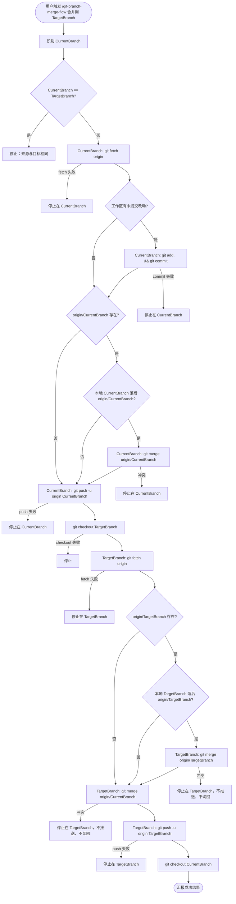

# Git Branch Merge Flow

## 功能与用法（中文说明）

### 功能说明

本 Skill 用于把你在仓库里**当前所在分支**上的改动，按固定顺序同步到**另一个分支**（目标分支），并推送到远端。流程概括如下。

**阶段一：在 `CurrentBranch` 上处理本地与远端**

1. 自动识别**当前分支**，并校验 `CurrentBranch` 与 `TargetBranch` **不相同**（相同则直接停止）。
2. **`git fetch origin`**（第一步即 fetch；只更新 `origin/*`，**不影响**工作区与未提交改动）。
3. 若有未提交改动则提交（在已掌握远端状态后再固化本地变动）。
4. 若本地 `CurrentBranch` 落后于 `origin/<CurrentBranch>`，先 `merge origin/<CurrentBranch>` 对齐；冲突则**停在 `CurrentBranch`**。
5. `git push` 把对齐后的当前分支推送到远端（push 成功后，本地 `origin/<CurrentBranch>` 引用由 git **自动更新**，无需再 fetch 一次）。

**阶段二：在 `TargetBranch` 上合并并推送**

6. 切换到**目标分支**。
7. **`git fetch origin`**（就近刷新，主要为拿到最新的 `origin/<TargetBranch>`）；若本地落后于 `origin/<TargetBranch>`，先对齐。
8. 将 **`origin/<CurrentBranch>`** 合并进目标分支（**不以本地 `CurrentBranch` 为合并来源**）。
9. **合并成功**：推送目标分支，切回当前分支并汇报。
10. **合并冲突**（任一 merge 阶段）：立即停止；留在冲突所在分支，目标分支冲突时不切回当前分支。

其中「当前分支」与「目标分支」分别对应 `CurrentBranch` 与 `TargetBranch`。完整分步流程见下方「完整流程」。

### 完整流程

#### 流程图



#### 分步说明

| 步骤 | 所在分支 | Git 操作 | 说明 | 失败时 |
|------|----------|----------|------|--------|
| 0 | `CurrentBranch` | 识别 `CurrentBranch`；校验 `CurrentBranch` ≠ `TargetBranch` | 来源与目标相同时无意义，直接停止 | 停止 |
| 1 | `CurrentBranch` | `git fetch origin` | **第一步即 fetch**；只更新 `origin/*`，不改变工作区与未提交改动 | 停止在 `CurrentBranch` |
| 2 | `CurrentBranch` | `git add .` + `git commit`（仅当有改动） | 在已 fetch 后再固化本地变动；提交说明用中文 | 停止在 `CurrentBranch` |
| 3a | `CurrentBranch` | 跳过 | `origin/CurrentBranch` 不存在（如新建分支尚未 push） | — |
| 3b | `CurrentBranch` | `git merge origin/CurrentBranch` | 本地**落后**远端时对齐 | 冲突则停止在 `CurrentBranch` |
| 3c | `CurrentBranch` | 跳过 | 本地已与 `origin/CurrentBranch` 一致或领先 | — |
| 4 | `CurrentBranch` | `git push -u origin CurrentBranch` | 发布对齐后的当前分支；push 成功后本地 `origin/CurrentBranch` 自动更新，**无需再 fetch** | 停止在 `CurrentBranch` |
| 5 | `TargetBranch` | `git checkout TargetBranch` | 切换到目标分支 | 停止 |
| 6 | `TargetBranch` | `git fetch origin` | **就近 fetch**；刷新 `origin/*`（主要为最新 `origin/TargetBranch`），陈旧窗口最小 | 停止在 `TargetBranch` |
| 7a | `TargetBranch` | 跳过 | `origin/TargetBranch` 不存在 | — |
| 7b | `TargetBranch` | `git merge origin/TargetBranch` | 本地目标分支**落后**远端时对齐 | 冲突则停止在 `TargetBranch`，不推送、不切回 |
| 7c | `TargetBranch` | 跳过 | 本地目标已与 `origin/TargetBranch` 一致或领先 | — |
| 8 | `TargetBranch` | `git merge origin/CurrentBranch` | **始终**以远端跟踪分支为合并来源 | 冲突则停止在 `TargetBranch`，不推送、不切回 |
| 9 | `TargetBranch` | `git push -u origin TargetBranch` | 推送合并后的目标分支 | 停止在 `TargetBranch` |
| 10 | `CurrentBranch` | `git checkout CurrentBranch` | 切回来源分支 | — |
| 11 | — | 汇报 | 按「Output Requirements」输出 | — |

#### 为什么第一步就 fetch（不必等 commit）

- `git fetch` **只**更新 `refs/remotes/origin/*`，**不**修改工作区、暂存区或当前分支指针。
- 因此即使存在未提交改动，也可以且**应该**先 fetch，尽早掌握远端最新状态。
- 正确顺序：**fetch → commit（如有）→ 对齐 → push**；commit 与 fetch 无依赖，但先 fetch 再 commit 更合理——提交前已知道远端是否有新提交需要对齐。

#### 为什么两次 fetch，且第二次放在阶段二

- **阶段一 fetch**：为在 push 前对齐本地 `CurrentBranch` 与 `origin/CurrentBranch`（否则 push 可能被拒或漏合并）。
- **push 成功会自动更新本地 `origin/CurrentBranch`**，所以阶段一 push 后**无需**再 fetch 来刷新当前分支的远端引用。
- **阶段二 fetch**：真正价值是拿到最新的 `origin/TargetBranch`。放在 `checkout TargetBranch` 之后、对齐之前，使目标分支远端引用的陈旧窗口最小。
- 注意：阶段二的全量 fetch 也会刷新 `origin/CurrentBranch`；若此刻有他人向当前分支推送了新提交，第 8 步合并的将是**最新的** `origin/CurrentBranch`（latest wins），这是可接受且通常期望的行为。

#### 分支与引用关系

```text
阶段一（CurrentBranch）：
  git fetch origin                      ← 第一步，无需等 commit
       ↓
  [commit 本地改动（如有）]
       ↓
  CurrentBranch ◀──merge── origin/CurrentBranch   （仅当本地落后时）
       ↓
  git push ──▶ origin/CurrentBranch     （push 成功后本地 origin/CurrentBranch 自动更新）

阶段二（TargetBranch）：
  checkout TargetBranch
       ↓
  git fetch origin                      ← 就近刷新，主要为 origin/TargetBranch
       ↓
  TargetBranch ◀──merge── origin/TargetBranch     （仅当本地落后时）
       ↓
  TargetBranch ◀──merge── origin/CurrentBranch    （合并来源，非本地 CurrentBranch）
       ↓
  git push ──▶ origin/TargetBranch
       ↓
  checkout CurrentBranch
```

#### 两条路径

**成功路径**

```text
CurrentBranch: fetch → [commit] → [对齐 origin/CurrentBranch（若落后）] → push
    → checkout TargetBranch
    → fetch（刷新 origin/TargetBranch）
    → [对齐 origin/TargetBranch（若落后）]
    → merge origin/CurrentBranch
    → push TargetBranch
    → checkout CurrentBranch
    → 汇报
```

**冲突路径**

```text
CurrentBranch 阶段冲突（对齐 origin/CurrentBranch）：
  → 立即停止，留在 CurrentBranch，不 checkout TargetBranch

TargetBranch 阶段冲突（对齐 origin/TargetBranch 或 merge origin/CurrentBranch）：
  → 立即停止，留在 TargetBranch，不 push TargetBranch，不切回 CurrentBranch
```

冲突阶段标识：

| 标识 | 所在分支 | 含义 |
|------|----------|------|
| `align-origin-current` | `CurrentBranch` | 对齐 `origin/CurrentBranch` 时冲突 |
| `align-origin-target` | `TargetBranch` | 对齐 `origin/TargetBranch` 时冲突 |
| `merge-origin-current` | `TargetBranch` | 合并 `origin/CurrentBranch` 时冲突 |

#### 禁止操作

| 操作 | 原因 |
|------|------|
| 来源与目标分支相同仍继续 | 无意义，且 `merge origin/自身` 可能污染分支 |
| 在 `CurrentBranch` 上 `git pull origin TargetBranch` | 方向反了：会把目标分支合进功能分支 |
| `git pull` 代替显式 `git fetch` + `git merge` | `pull.rebase` 等配置会改变行为 |
| 未 fetch 就对齐或 push | 无法感知远端最新状态 |
| 在 `TargetBranch` 上 `git merge CurrentBranch`（本地） | 应用 `git merge origin/CurrentBranch` |
| push / fetch 失败后继续后续步骤 | 状态不可靠，必须立即停止 |

### 使用方法

1. 在目标 Git 仓库里，先 `git checkout` 到你希望作为「来源」的分支（即日常开发分支），保证要交付的代码都在这个分支上。
2. 在对话里发送触发语句，把末尾换成真实的**目标分支**名即可：

```text
/git-branch-merge-flow 合并到<目标分支>
```

示例：把当前分支合并进 `dev`：

```text
/git-branch-merge-flow 合并到dev
```

3. 由 Agent 按本文件中的步骤执行命令；你只需在冲突时按提示解决冲突后，再自行决定后续提交或推送。

### 使用注意

- 默认远端为 `origin`，分支名与本地一致；若你使用其它 remote 或特殊分支策略，需在对话里额外说明。
- **来源与目标必须不同**：`CurrentBranch` 与 `TargetBranch` 相同时直接停止，不执行任何 push / merge。
- 若当前分支存在未提交改动，需要自动提交时，提交说明默认使用**中文**，并尽量贴合实际改动文件内容；不要只写笼统描述。
- 提交说明应避免机械化表达，不要写“将 A 分支合并到 B 分支”这类不自然表述。
- 若用户明确给出提交说明格式或文案，优先按用户要求执行。
- 在 Windows PowerShell 中，避免用管道把中文直接传给 `git commit -F -`；请使用 UTF-8（无 BOM）临时文件传入 `-F`，以降低中文提交信息出现乱码（如 `??`）的概率。
- `git push` 或 `git fetch` 失败时应立即停止，不继续后续步骤。
- **第一步即 fetch**：`git fetch` 不影响未提交改动，无需等 commit；先 fetch 再 commit 再对齐。
- **CurrentBranch 须 fetch → commit → 对齐 → push**：本地落后 `origin/CurrentBranch` 时，须在 push 前 merge 远端。
- **TargetBranch 合并来源始终是 `origin/CurrentBranch`**：切到目标分支后就近 fetch 刷新，再以远端跟踪分支为准合并。

### 合并前 fetch 与对齐说明

- `git fetch origin` 只更新本地 `origin/*`，**不**改变当前分支与工作区。
- **CurrentBranch** 与 **TargetBranch** 均遵循同一对齐规则（脚本中由共享函数 `Invoke-AlignWithRemote` 实现）：若本地落后 `origin/<分支名>` 则 `git merge origin/<分支名>`；不存在则跳过；已一致或领先则跳过。
- **禁止**在 **CurrentBranch** 上执行 `git pull origin <TargetBranch>`（方向反了）。
- **禁止**使用 `git pull` 代替显式 `git fetch` + `git merge`。
- 在 **TargetBranch** 上执行 `git merge origin/<CurrentBranch>`，**不要**执行 `git merge <CurrentBranch>`（本地分支）。

## Instructions

Follow the **完整流程** section above. When the user provides the **目标分支** (target branch) name, often via `/git-branch-merge-flow 合并到<目标分支>`:

**Phase 1 — on `CurrentBranch`**

1. Capture **当前分支** as `CurrentBranch`. **If `CurrentBranch` equals `TargetBranch`, stop immediately** (nothing to merge).
2. Run `git fetch origin` **first** (safe with uncommitted changes; only updates `origin/*`). **Stop immediately if fetch fails.**
3. Commit pending changes (if any), with a Chinese message reflecting real file-level changes.
4. Align local `CurrentBranch` with `origin/<CurrentBranch>` when applicable:
   - If `origin/<CurrentBranch>` does not exist, skip alignment (e.g. brand-new branch).
   - If local is behind `origin/<CurrentBranch>`, run `git merge origin/<CurrentBranch>`.
   - If local is up to date or ahead, skip.
   - If alignment conflicts, **stop on `CurrentBranch`**; do not checkout target.
5. Push `CurrentBranch` to `origin`. **Stop immediately if push fails.** (A successful push updates the local `origin/<CurrentBranch>` ref automatically; no extra fetch needed here.)

**Phase 2 — on `TargetBranch`**

6. Switch to `TargetBranch`. **Stop immediately if checkout fails.**
7. Run `git fetch origin` (refreshes `origin/*`, primarily to get the latest `origin/<TargetBranch>`). **Stop immediately if fetch fails.** Then align local `TargetBranch` with `origin/<TargetBranch>` when applicable (same rules as step 4).
   - If alignment conflicts, stop on `TargetBranch`; do not push; do not switch back.
8. Merge **`origin/<CurrentBranch>`** into `TargetBranch`. **Do not** merge local `CurrentBranch`.
9. If merge conflicts at any merge step on `TargetBranch`:
   - Stop immediately on `TargetBranch`.
   - Report conflict phase and conflict files.
   - Do not switch back to `CurrentBranch`.
   - Do not push `TargetBranch`.
10. If all steps succeed:
    - Push `TargetBranch`. **Stop immediately if push fails.**
    - Switch back to `CurrentBranch`.
    - Report success including both alignment phases and merge details.

## Command Workflow (Windows PowerShell)

Use this exact command sequence; only replace the target branch placeholder:

```powershell
# Only the target branch is required input. Current branch is detected automatically.
$TargetBranch = "target-branch-name"

$CurrentBranch = git rev-parse --abbrev-ref HEAD
$OriginCurrentRef = "origin/$CurrentBranch"

# Guard: source and target must differ
if ($CurrentBranch -eq $TargetBranch) {
  Write-Host "CurrentBranch 与 TargetBranch 相同（$CurrentBranch），无需合并。停止。"
  exit 1
}

# Detect repository identifier dynamically for final report.
$OriginUrl = git remote get-url origin 2>$null
$RepoIdentifier = ""
if ($LASTEXITCODE -eq 0 -and $OriginUrl) {
  $NormalizedUrl = $OriginUrl.Trim() -replace '\\', '/'
  $RepoIdentifier = ($NormalizedUrl -split '/')[-1]
  if ($RepoIdentifier.EndsWith(".git")) {
    $RepoIdentifier = $RepoIdentifier.Substring(0, $RepoIdentifier.Length - 4)
  }
}
if (-not $RepoIdentifier) {
  $GitTopLevel = git rev-parse --show-toplevel
  $RepoIdentifier = Split-Path $GitTopLevel -Leaf
}

$ConflictPhase = ""

# Shared helper: align the currently checked-out $Branch with origin/$Branch when behind.
# Reports back through $script:AlignStatus (none|merged|skipped) and $script:AlignDetail.
# On merge conflict, sets $script:ConflictPhase = $ConflictLabel and exits 1 (stays on $Branch).
function Invoke-AlignWithRemote {
  param(
    [Parameter(Mandatory = $true)][string]$Branch,
    [Parameter(Mandatory = $true)][string]$ConflictLabel
  )

  $remoteRef = "origin/$Branch"
  $script:AlignStatus = "skipped"
  $script:AlignDetail = "远端不存在 $remoteRef，跳过对齐"

  git rev-parse $remoteRef 2>$null
  if ($LASTEXITCODE -ne 0) { return }

  $behind = [int](git rev-list --count "$Branch..$remoteRef")
  $ahead = [int](git rev-list --count "$remoteRef..$Branch")

  if ($behind -gt 0) {
    git merge $remoteRef
    if ($LASTEXITCODE -ne 0) {
      $script:ConflictPhase = $ConflictLabel
      Write-Host "Merge conflict while aligning $Branch with $remoteRef. Stay on $Branch and stop."
      exit 1
    }
    $script:AlignStatus = "merged"
    $script:AlignDetail = "已 merge $remoteRef（落后 $behind 个提交）"
  } else {
    $script:AlignStatus = "none"
    if ($ahead -gt 0) {
      $script:AlignDetail = "本地领先 origin $ahead 个提交，无需对齐"
    } else {
      $script:AlignDetail = "已与 origin 一致"
    }
  }
}

# --- Phase 1: CurrentBranch — fetch, commit, align, push ---

# First fetch (before commit; safe with uncommitted changes)
git fetch origin
if ($LASTEXITCODE -ne 0) { exit 1 }

$HadNewCommit = $false
if ((git status --porcelain).Length -gt 0) {
  $CommitMessage = "完善文档说明与流程细节"
  git add .
  $CommitMsgFile = Join-Path (git rev-parse --git-dir) "commit-msg-utf8.txt"
  $Utf8NoBom = New-Object System.Text.UTF8Encoding $false
  [System.IO.File]::WriteAllText($CommitMsgFile, $CommitMessage, $Utf8NoBom)
  git commit -F $CommitMsgFile
  if ($LASTEXITCODE -ne 0) { exit 1 }
  Remove-Item -Force $CommitMsgFile
  $HadNewCommit = $true
}

Invoke-AlignWithRemote -Branch $CurrentBranch -ConflictLabel "align-origin-current"
$CurrentAligned = $AlignStatus
$CurrentAlignDetail = $AlignDetail

git push -u origin $CurrentBranch
if ($LASTEXITCODE -ne 0) { exit 1 }
# A successful push updates local origin/$CurrentBranch automatically; no extra fetch needed.

# --- Phase 2: TargetBranch — checkout, fetch, align, merge origin/CurrentBranch, push ---

git checkout $TargetBranch
if ($LASTEXITCODE -ne 0) { exit 1 }

# Fetch here, right before using origin/$TargetBranch (smallest staleness window).
git fetch origin
if ($LASTEXITCODE -ne 0) { exit 1 }

Invoke-AlignWithRemote -Branch $TargetBranch -ConflictLabel "align-origin-target"
$TargetAligned = $AlignStatus
$TargetAlignDetail = $AlignDetail

# Record SHAs for the final report (after fetch/align, before merge)
$OriginCurrentSha = git rev-parse --short $OriginCurrentRef
$OriginTargetSha = ""
git rev-parse "origin/$TargetBranch" 2>$null
if ($LASTEXITCODE -eq 0) { $OriginTargetSha = git rev-parse --short "origin/$TargetBranch" }

# Merge origin/CurrentBranch into target (NOT local CurrentBranch)
git merge $OriginCurrentRef
if ($LASTEXITCODE -ne 0) {
  $ConflictPhase = "merge-origin-current"
  Write-Host "Merge conflict while merging $OriginCurrentRef into $TargetBranch. Stay on $TargetBranch and stop."
  exit 1
}

git push -u origin $TargetBranch
if ($LASTEXITCODE -ne 0) { exit 1 }

git checkout $CurrentBranch
Write-Host "Done: guarded, aligned $CurrentBranch ($CurrentAligned), pushed, checked out $TargetBranch & fetched, aligned ($TargetAligned), merged $OriginCurrentRef, pushed $TargetBranch, switched back to $CurrentBranch."
Write-Host "涉及仓库：$RepoIdentifier"
```

## Output Requirements

Always report:

- detected **当前分支** and **目标分支** names (and that they differ)
- whether the current branch had a new commit before align
- **CurrentBranch** alignment status (`none` / `merged` / `skipped`) with detail
- push status for **CurrentBranch**
- fetch status (phase 1 on current, phase 2 on target)
- `origin/<CurrentBranch>` ref and short SHA used as merge source
- **TargetBranch** alignment status (`none` / `merged` / `skipped`) with detail
- feature-branch merge status (source: `origin/<CurrentBranch>`)
- final branch after workflow
- involved repository line: `涉及仓库：\`<repo-identifier>\``

Success case should follow this style:

```text
已按 /git-branch-merge-flow 合并到<目标分支> 执行完成，结果如下：

- 当前分支（CurrentBranch）：`<current-branch>`
- 目标分支（TargetBranch）：`<target-branch>`
- 当前分支是否先产生新提交：<是/否>
- 新提交：`<commit-sha>`（`<commit-message>`）（若无则写「无」）
- 阶段一 fetch（CurrentBranch）：已执行
- 当前分支对齐：<none | merged | skipped>（<CurrentAlignDetail>）
- 当前分支推送：成功
- 阶段二 fetch（切到 TargetBranch 后）：已执行（origin/<target> @ <sha>）
- 合并来源：`origin/<current-branch>` @ `<sha>`（非本地分支）
- 目标分支对齐：<none | merged | skipped>（<TargetAlignDetail>）
- 功能分支合并：成功（<fast-forward | merge commit>，`origin/<current-branch>` → `<target-branch>`）
- 最终所在分支：`<final-branch>`
- 涉及仓库：`<repo-identifier>`

已执行的关键动作：

- 已校验来源与目标分支不同
- 已在 `<current-branch>` 上先 fetch，再 commit（若需要）并对齐 `origin/<current-branch>`
- 已将 `<current-branch>` 推送到远端
- 已切换到 `<target-branch>` 并 fetch、对齐 `origin/<target-branch>`（若需要）
- 已合并 `origin/<current-branch>` 到 `<target-branch>`
- 已将 `<target-branch>` 推送到远端
- 已切回 `<current-branch>` 分支
```

Conflict case report must explicitly state:

- **stopped branch** (`CurrentBranch` or `TargetBranch`)
- if stopped on `TargetBranch`: did not switch back to `CurrentBranch`, did not push `TargetBranch`
- if stopped on `CurrentBranch`: did not checkout `TargetBranch`
- **冲突阶段**：`align-origin-current` / `align-origin-target` / `merge-origin-current`
- **冲突文件**：`<list>`

## Version Notes

- Current effective version: `1.5.0`
- Default behavior when user does not specify version: use this latest `SKILL.md`.
- Historical snapshots should be kept under `versions/<version>/SKILL.md`.
- `1.5.0`: 相对 `1.4.0` 的整体升级——合并来源改为 `origin/<CurrentBranch>`（非本地分支）；`CurrentBranch` 与 `TargetBranch` 落后各自 `origin/*` 时统一对齐；`CurrentBranch` 采用「先 fetch 再 commit」顺序，push 后不再重复 fetch，第二次 fetch 放在阶段二切到目标分支之后；新增 `CurrentBranch != TargetBranch` 守卫；对齐逻辑抽取为共享函数 `Invoke-AlignWithRemote`；补全流程图与分步表。

## Example Prompt

```text
/git-branch-merge-flow 合并到<目标分支>

示例：
/git-branch-merge-flow 合并到release/yyy
```
